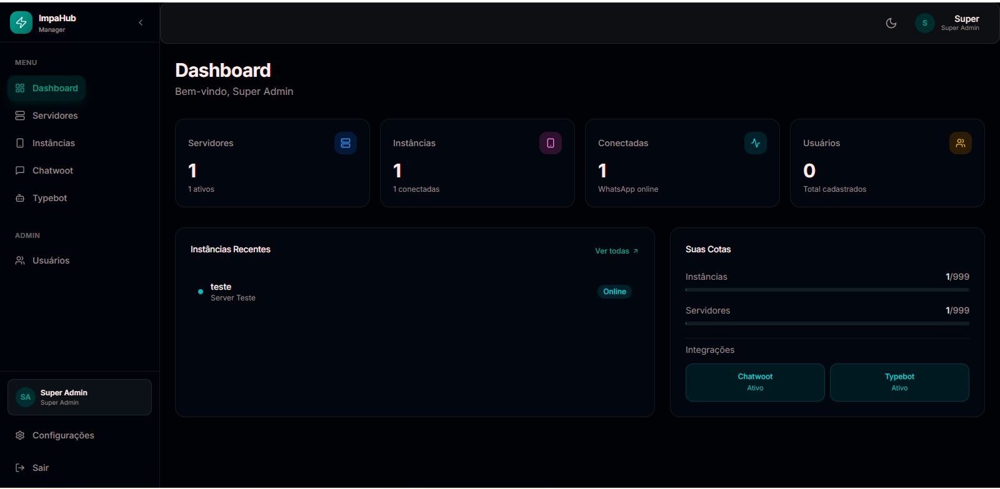
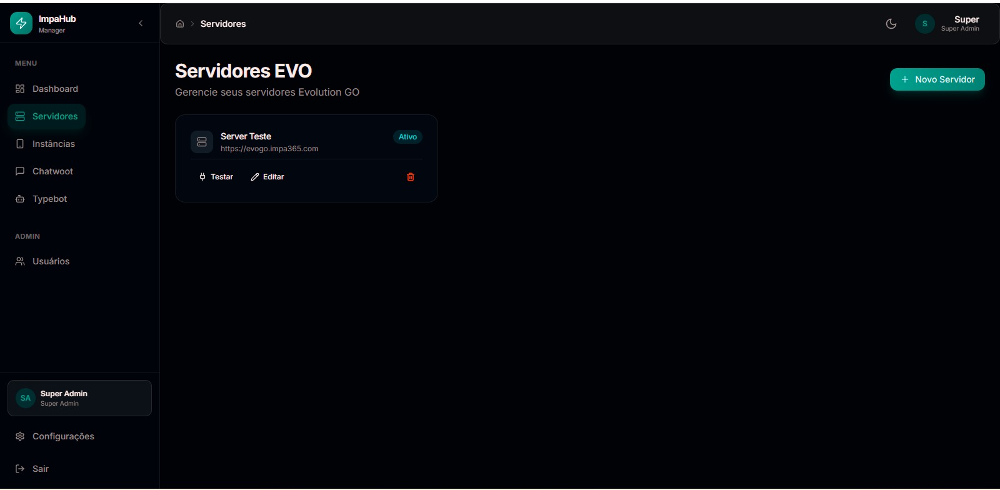
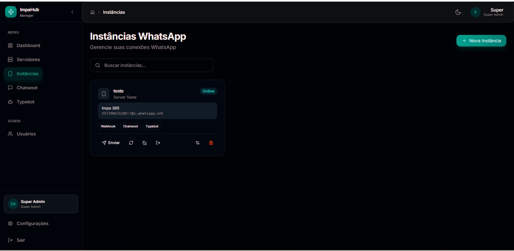
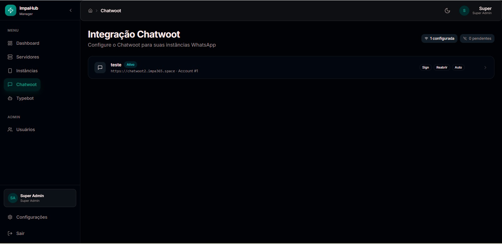
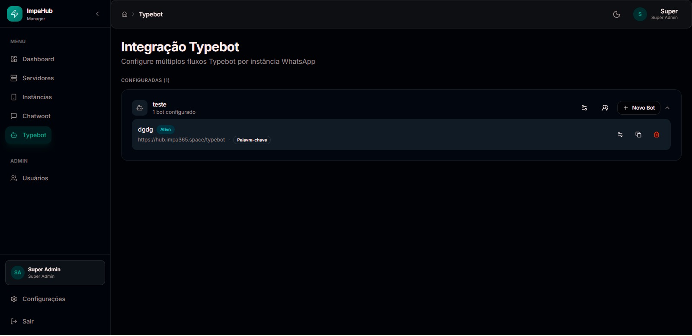
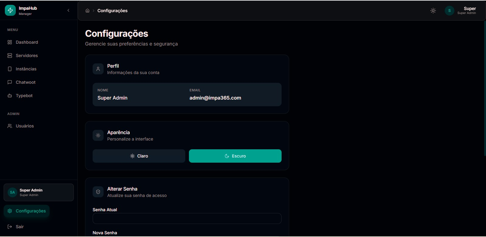

<p align="center">
  
</p>

<h1 align="center">⚡ IMPA HUB</h1>

<p align="center">
  <strong>Hub de Integrações para Evolution GO</strong><br>
  Conecte o Evolution GO ao Chatwoot e Typebot com máxima performance
</p>

<p align="center">
  <a href="https://github.com/impa365/impahub/releases"></a>
  <a href="https://hub.docker.com/r/impa365/impa-hub"></a>
  <a href="https://github.com/impa365/impahub/blob/main/LICENSE"></a>
  
  
</p>

---

## 📋 O que é o IMPA HUB?

O **IMPA HUB** é um hub de integrações open-source construído em **Go** que conecta o [Evolution GO](https://github.com/EvolutionAPI/evolution-go) ao **Chatwoot** e **Typebot**, oferecendo um painel de gerenciamento completo em **React**.

### Por que Go?

- 🚀 **Ultra leve** — ~50MB de memória em produção
- ⚡ **Ultra rápido** — Respostas em microsegundos
- 📦 **Binário único** — Fácil de deployar, sem dependências externas

---

## 🖼️ Screenshots

### Dashboard
Visão geral com métricas de servidores, instâncias, conexões e usuários.

<p align="center">
  
</p>

### Servidores Evolution GO
Gerencie múltiplos servidores Evolution GO. Teste conexão, edite ou remova.

<p align="center">
  
</p>

### Instâncias WhatsApp
Gerencie suas conexões WhatsApp com QR Code, envio de mensagens, webhook, Chatwoot e Typebot integrados.

<p align="center">
  
</p>

### Integração Chatwoot
Configure o Chatwoot para cada instância WhatsApp com assinatura de agente, reabertura automática e criação de contatos.

<p align="center">
  
</p>

### Integração Typebot
Configure múltiplos fluxos Typebot por instância, com palavra-chave de ativação.

<p align="center">
  
</p>

### Configurações
Perfil do usuário, alternância de tema claro/escuro e alteração de senha.

<p align="center">
  
</p>

---

## ✨ Funcionalidades

### 💬 Integração Chatwoot
- ✅ Mensagens bidirecionais (texto, imagens, vídeos, documentos, áudio)
- ✅ Criação automática de contatos e conversas
- ✅ Suporte a **mensagens de grupo** (com nome real do grupo)
- ✅ Assinatura de mensagens por agente
- ✅ Reabertura automática de conversas
- ✅ Anti-duplicação inteligente de mensagens
- ✅ Suporte a números brasileiros (merge 9 dígitos)

### 🤖 Integração Typebot
- ✅ Múltiplos fluxos por instância
- ✅ Ativação por palavra-chave
- ✅ Controle de sessões por contato

### 👥 Multi-tenancy & Quotas
- 👑 SuperAdmin / Admin / User
- ✅ Quotas por usuário (instâncias, conexões, servidores)
- ✅ Permissões granulares por integração

### 🌐 Multi-servidor
- ✅ Conecte múltiplos servidores Evolution GO
- ✅ Cada usuário com instâncias em servidores diferentes
- ✅ Teste de conexão automático

### 🎨 Painel de Gerenciamento
- ✅ UI moderna com tema dark/light
- ✅ Dashboard com visão geral
- ✅ Gerenciamento completo de instâncias, servidores e integrações

---

## 🏗️ Arquitetura

```
┌─────────────────┐     ┌──────────────┐     ┌───────────────┐
│   WhatsApp      │────▶│ Evolution GO │────▶│   IMPA HUB    │
│   (usuários)    │◀────│   (API)      │◀────│   (backend)   │
└─────────────────┘     └──────────────┘     └───────┬───────┘
                                                      │
                                              ┌───────┴───────┐
                                              │               │
                                        ┌─────▼─────┐  ┌─────▼─────┐
                                        │  Chatwoot  │  │  Typebot  │
                                        │  (suporte) │  │  (bots)   │
                                        └───────────┘  └───────────┘
```

| Componente | Tecnologia | Imagem Docker |
|------------|-----------|---------------|
| **Backend** | Go 1.22 + Gin + GORM | `impa365/impa-hub:latest` |
| **Frontend** | React 18 + TypeScript + Tailwind | `impa365/impa-hub-manager:latest` |
| **Banco** | PostgreSQL | - |

---

## 🚀 Deploy

### Docker Compose (rápido)

```bash
# Clone o repositório
git clone https://github.com/impa365/impahub.git
cd impahub/impa-hub

# Configure o .env
cp .env.example .env
# Edite o .env com suas configurações

# Suba
docker compose up -d
```

### Docker Swarm (produção)

Use o arquivo `stack-swarm.yaml` na raiz do projeto. Ele já vem configurado com **Traefik** e health checks.

```bash
# Edite o stack-swarm.yaml com seus domínios e senhas
# Depois faça deploy:
docker stack deploy -c stack-swarm.yaml impahub
```

### Docker Pull (imagens prontas)

```bash
docker pull impa365/impa-hub:latest
docker pull impa365/impa-hub-manager:latest
```

> As imagens são multi-arch: **amd64** e **arm64**

---

## ⚙️ Variáveis de Ambiente

### Backend (`impa-hub`)

| Variável | Descrição | Padrão |
|----------|-----------|--------|
| `SERVER_PORT` | Porta do servidor | `8080` |
| `BASE_URL` | URL pública do backend | `http://localhost:8080` |
| `DATABASE_URL` | Connection string PostgreSQL | - |
| `JWT_SECRET` | Chave secreta JWT | - |
| `JWT_EXPIRATION_HOURS` | Expiração do token em horas | `24` |
| `ADMIN_EMAIL` | Email do super admin inicial | `admin@impa.hub` |
| `ADMIN_PASSWORD` | Senha do super admin inicial | `admin123` |
| `LOG_LEVEL` | Nível de log (`debug`, `info`, `warn`, `error`) | `info` |
| `CORS_ORIGINS` | Origens CORS permitidas | `*` |

### Frontend (`impa-hub-manager`)

| Variável | Descrição | Padrão |
|----------|-----------|--------|
| `VITE_API_URL` | URL da API do backend | `http://localhost:8080` |

---

## 📡 API Endpoints

<details>
<summary><strong>Auth</strong></summary>

| Método | Rota | Descrição |
|--------|------|-----------|
| `POST` | `/api/v1/auth/login` | Login |
| `POST` | `/api/v1/auth/change-password` | Alterar senha |
| `GET` | `/api/v1/auth/me` | Dados do usuário logado |

</details>

<details>
<summary><strong>Admin (SuperAdmin)</strong></summary>

| Método | Rota | Descrição |
|--------|------|-----------|
| `GET` | `/api/v1/admin/users` | Listar usuários |
| `POST` | `/api/v1/admin/users` | Criar usuário |
| `GET` | `/api/v1/admin/users/:id` | Detalhes do usuário |
| `PUT` | `/api/v1/admin/users/:id` | Atualizar usuário |
| `DELETE` | `/api/v1/admin/users/:id` | Remover usuário |
| `PUT` | `/api/v1/admin/users/:id/quotas` | Atualizar quotas |
| `POST` | `/api/v1/admin/users/:id/reset-password` | Resetar senha |

</details>

<details>
<summary><strong>Servidores Evolution GO</strong></summary>

| Método | Rota | Descrição |
|--------|------|-----------|
| `GET` | `/api/v1/servers` | Listar servidores |
| `POST` | `/api/v1/servers` | Adicionar servidor |
| `GET` | `/api/v1/servers/:id` | Detalhes |
| `PUT` | `/api/v1/servers/:id` | Atualizar |
| `DELETE` | `/api/v1/servers/:id` | Remover |
| `POST` | `/api/v1/servers/:id/test` | Testar conexão |

</details>

<details>
<summary><strong>Instâncias WhatsApp</strong></summary>

| Método | Rota | Descrição |
|--------|------|-----------|
| `GET` | `/api/v1/instances` | Listar instâncias |
| `POST` | `/api/v1/instances` | Criar instância |
| `GET` | `/api/v1/instances/:id` | Detalhes |
| `DELETE` | `/api/v1/instances/:id` | Remover |
| `POST` | `/api/v1/instances/:id/connect` | Conectar (QR) |
| `GET` | `/api/v1/instances/:id/status` | Status |
| `GET` | `/api/v1/instances/:id/qr` | QR Code |
| `POST` | `/api/v1/instances/:id/disconnect` | Desconectar |
| `POST` | `/api/v1/instances/:id/logout` | Logout |
| `POST` | `/api/v1/instances/:id/reconnect` | Reconectar |
| `POST` | `/api/v1/instances/:id/send/text` | Enviar texto |
| `POST` | `/api/v1/instances/:id/send/media` | Enviar mídia |

</details>

<details>
<summary><strong>Integração Chatwoot</strong></summary>

| Método | Rota | Descrição |
|--------|------|-----------|
| `GET` | `/api/v1/integrations/chatwoot` | Listar configs |
| `POST` | `/api/v1/integrations/chatwoot/set` | Configurar |
| `GET` | `/api/v1/integrations/chatwoot/:instanceId` | Detalhes |
| `PUT` | `/api/v1/integrations/chatwoot/:instanceId` | Atualizar |
| `DELETE` | `/api/v1/integrations/chatwoot/:instanceId` | Remover |

</details>

<details>
<summary><strong>Webhooks</strong></summary>

| Método | Rota | Descrição |
|--------|------|-----------|
| `POST` | `/webhook/:instanceId` | Webhook do Evolution GO |
| `POST` | `/chatwoot/webhook/:instanceId` | Webhook do Chatwoot |

</details>

---

## 🛠️ Desenvolvimento Local

```bash
# Backend
cd impa-hub
cp .env.example .env
go mod tidy
make dev

# Frontend
cd impa-hub-manager
npm install
npm run dev
```

---

## 📦 Estrutura do Projeto

```
impahub/
├── impa-hub/                    # Backend Go
│   ├── cmd/impa-hub/            # Entry point
│   ├── internal/
│   │   ├── admin/               # Gestão de usuários
│   │   ├── auth/                # Autenticação JWT
│   │   ├── chatwoot/            # Integração Chatwoot
│   │   ├── config/              # Configuração
│   │   ├── database/            # Conexão PostgreSQL
│   │   ├── evoclient/           # Client Evolution GO
│   │   ├── instance/            # Gestão de instâncias
│   │   ├── middleware/          # Auth middleware
│   │   ├── models/              # Modelos do banco
│   │   ├── server/              # Gestão de servidores
│   │   ├── typebot/             # Integração Typebot
│   │   └── webhook/             # Receptor de webhooks
│   ├── Dockerfile
│   ├── docker-compose.yml
│   └── Makefile
├── impa-hub-manager/            # Frontend React
│   ├── src/
│   │   ├── components/          # Componentes React
│   │   ├── pages/               # Páginas
│   │   ├── services/            # API client
│   │   ├── store/               # Estado global
│   │   └── types/               # Tipos TypeScript
│   ├── Dockerfile
│   └── nginx.conf
├── stack-swarm.yaml             # Stack Docker Swarm
├── docs/screenshots/            # Screenshots do sistema
└── README.md
```

---

## 📄 Licença

Este projeto está sob a licença [MIT](LICENSE).

---

<p align="center">
  Feito com ⚡ por <a href="https://github.com/impa365">IMPA365</a>
</p>
